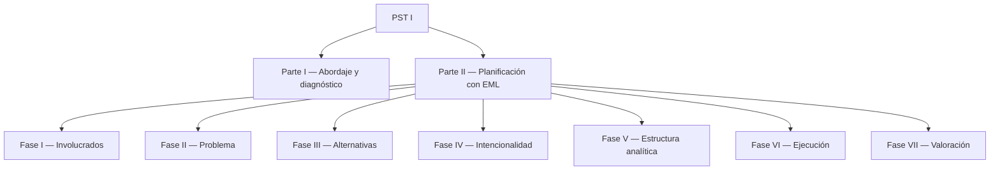

# Introducción

## ¿Qué es un Proyecto Socio Tecnológico (PST)?

El **Proyecto Socio Tecnológico** es la unidad curricular eje del Programa Nacional de Formación en Informática (PNFI). Articula la academia con la comunidad: los estudiantes diagnostican una realidad concreta, planifican una intervención y la ejecutan junto con los actores sociales involucrados.

El **PST I** es el primero de cuatro proyectos (PST I, II, III y IV), uno por cada año de la carrera, y se centra en:

- El **abordaje** de una comunidad.
- El **diagnóstico** de sus necesidades tecnológicas.
- La **alfabetización tecnológica** y el **soporte técnico** como producto entregable.

::: tip ¿Nunca hiciste un proyecto así?
Tranquilo. Esta guía está pensada para acompañarte **desde la primera reunión con la comunidad hasta la defensa final**, sin asumir conocimientos previos. Si te quedás trabado en un apartado, usá el **buscador** (arriba a la derecha) para saltar al concepto.
:::

## La estructura general del PST I

El esquema oficial divide el trabajo en dos partes:

## El Enfoque del Marco Lógico (EML) en una línea

> **Diagnosticar → analizar → planificar → ejecutar → evaluar — todo articulado y trazable.**

Las siete fases de la Parte II del PST I son la operacionalización del EML: cada fase se conecta lógicamente con la siguiente, y cada decisión tiene que poder rastrearse hasta el problema que la justifica.

## Cómo está organizada cada página

Cada apartado de la guía sigue esta estructura:

1. **¿Qué pide el esquema?** — La consigna formal en pocas líneas.
2. **Ejemplo de referencia** — Un caso real para que veas el nivel de detalle esperado.
3. **Recomendaciones** — Tips prácticos para tu propio proyecto.

## Antes de empezar — checklist mínimo

- [ ] Tenés identificada (o estás por identificar) una **comunidad** dispuesta a recibirte.
- [ ] Sabés con qué **tutor/asesor** vas a coordinar tus avances.
- [ ] Tenés definido el **equipo de trabajo** (compañeros del PNFI).
- [ ] Conocés los **plazos** del cuatrimestre.

Si te falta alguno, anotalo y resolvelo en la primera semana — sin estos cuatro puntos el proyecto no arranca.

Empezá por la **[Parte I — Descripción del proceso de abordaje](/parte-1/descripcion-proceso)**.
